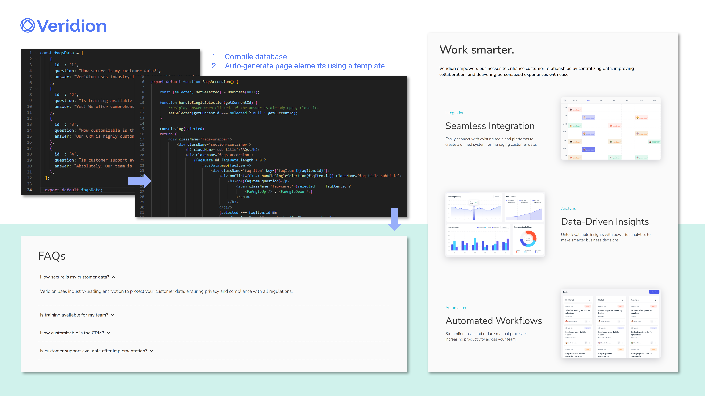

# CRM-landing-page
A landing page for a fictional CRM company. 

## Highlights:

- Live typing effect text       | React and GSAP
- Dynamic menu button           | React and GSAP
- Responsive                    | Flexible layout across different device types
- User experience               | Intuitive design, web accessibility

 

 

 
 

 
 

## New skills learnt:

#### React, writing modular code & GSAP:
- Programming in React for improved site performance.
- Writing more modular code and organising this effectively.
- Using databases to minimise code duplication.
- Using useState and useEffect to store data and dynamically update page elements.
- Using GSAP to animate page elements. 
- Using documentation to understand how to use the GSAP library.

#### User experience:
- Animated navigation bar button that toggles between a 'hamburger menu' and an 'X' icon.
- Navigation bar that disappears depending on scroll position.
- Collapsable accordion-style FAQ section that displays only one tab at a time for improved readability.
- Use of visual heirarchy and consistent styles throughout the web page.

 

 
 
Individual device mockups from <a href="http://aygray.com/" target="_blank" rel='noopener noreferrer'>Andrew Gray</a> (<a href="https://creativecommons.org/licenses/by/4.0/" taget="blank">CC BY 4.0 license</a>)